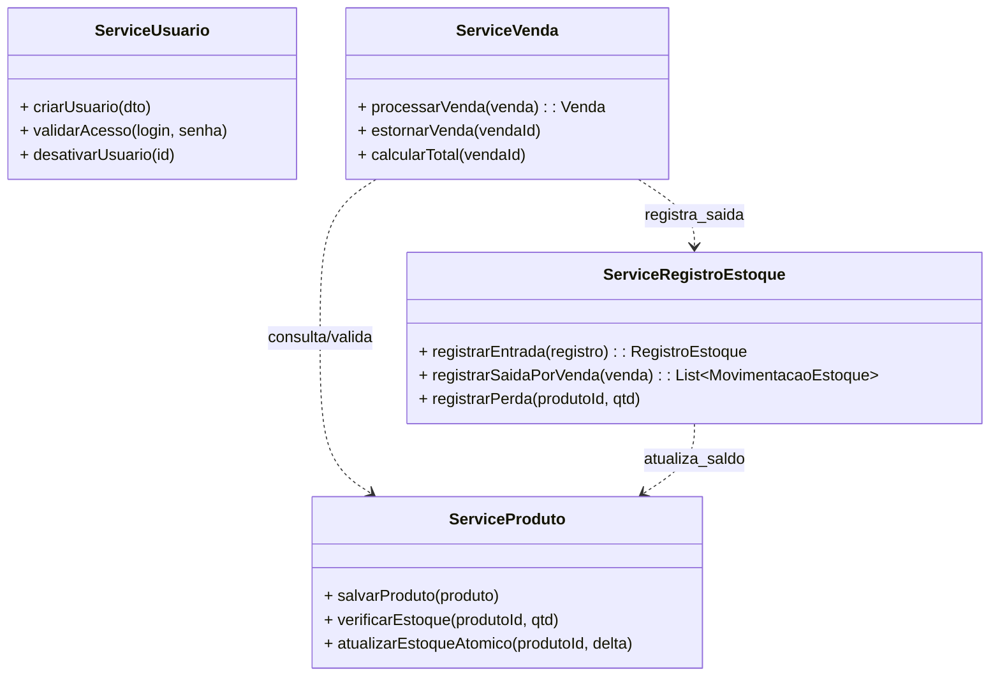

# Diagrama: Services (Mermaid)

Descrição: Camada Control com métodos de orquestração e operações atômicas.

```mermaid
classDiagram
  class ServiceUsuario {
    + criarUsuario(dto)
    + validarAcesso(login, senha)
    + desativarUsuario(id)
  }
  class ServiceProduto {
    + salvarProduto(produto)
    + verificarEstoque(produtoId, qtd)
    + atualizarEstoqueAtomico(produtoId, delta)
  }
  class ServiceVenda {
    + processarVenda(venda): Venda
    + estornarVenda(vendaId)
    + calcularTotal(vendaId)
  }
  class ServiceRegistroEstoque {
    + registrarEntrada(registro): RegistroEstoque
    + registrarSaidaPorVenda(venda): List~MovimentacaoEstoque~
    + registrarPerda(produtoId, qtd)
  }

  ServiceVenda ..> ServiceProduto : consulta/valida
  ServiceVenda ..> ServiceRegistroEstoque : registra_saida
  ServiceRegistroEstoque ..> ServiceProduto : atualiza_saldo
```
