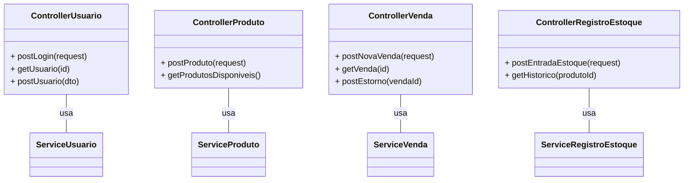

# Diagrama: Controllers (Mermaid)

Descrição: Boundaries que expõem endpoints/GUI e usam os Services.

```mermaid
classDiagram
  class ControllerUsuario {
    + postLogin(request)
    + getUsuario(id)
    + postUsuario(dto)
  }
  class ControllerProduto {
    + postProduto(request)
    + getProdutosDisponiveis()
  }
  class ControllerVenda {
    + postNovaVenda(request)
    + getVenda(id)
    + postEstorno(vendaId)
  }
  class ControllerRegistroEstoque {
    + postEntradaEstoque(request)
    + getHistorico(produtoId)
  }

  ControllerUsuario -- ServiceUsuario : usa
  ControllerProduto -- ServiceProduto : usa
  ControllerVenda -- ServiceVenda : usa
  ControllerRegistroEstoque -- ServiceRegistroEstoque : usa
```
