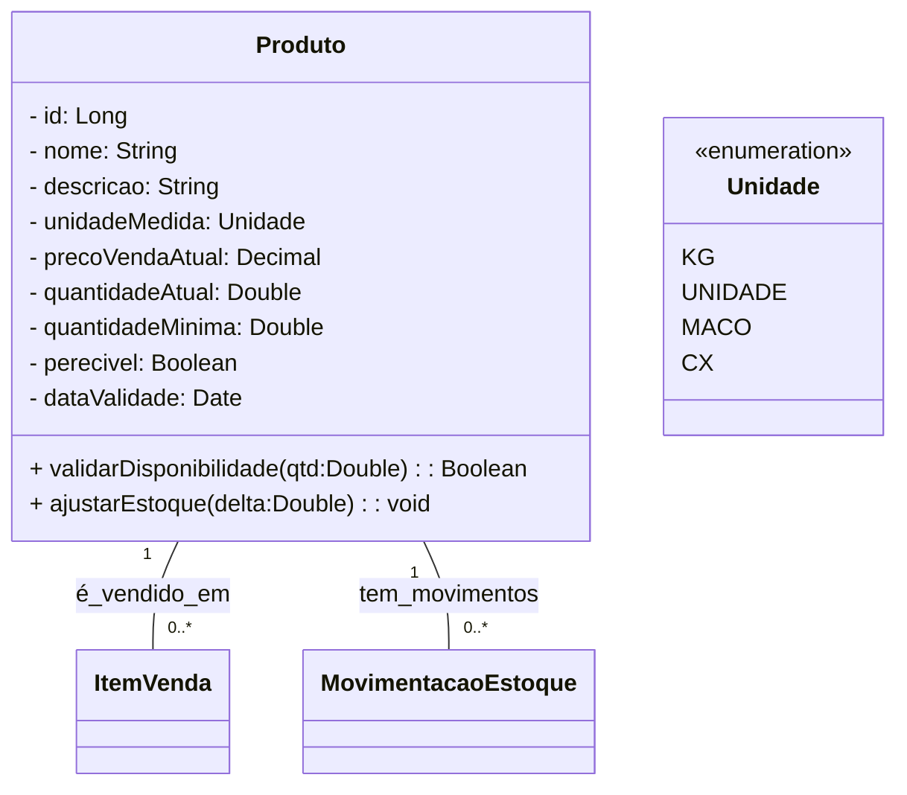

# Diagrama: Produto (Mermaid)

Descrição: Produto vendido no hortifruti, com controle de medidas e estoque.

```mermaid
classDiagram
  class Produto {
    - id: Long
    - nome: String
    - descricao: String
    - unidadeMedida: Unidade
    - precoVendaAtual: Decimal
    - quantidadeAtual: Double
    - quantidadeMinima: Double
    - perecivel: Boolean
    - dataValidade: Date
    + validarDisponibilidade(qtd:Double): Boolean
    + ajustarEstoque(delta:Double): void
  }

  %% Unidade (enum-like)
  class Unidade {
    <<enumeration>>
    KG
    UNIDADE
    MACO
    CX
  }

  class ItemVenda
  class MovimentacaoEstoque
  Produto "1" -- "0..*" ItemVenda : é_vendido_em
  Produto "1" -- "0..*" MovimentacaoEstoque : tem_movimentos
```
