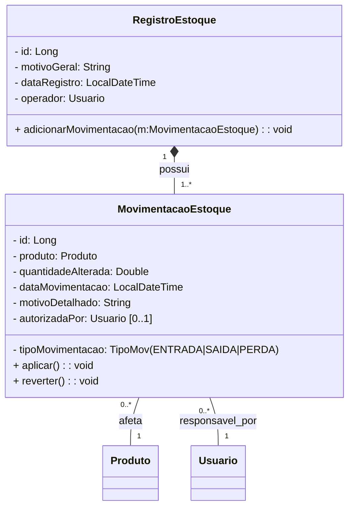

# Diagrama: RegistroEstoque + MovimentacaoEstoque (Mermaid)

Descrição: Header/detail para movimentos de estoque (facilita auditoria).

```mermaid
classDiagram
  class RegistroEstoque {
    - id: Long
    - motivoGeral: String
    - dataRegistro: LocalDateTime
    - operador: Usuario
    + adicionarMovimentacao(m:MovimentacaoEstoque): void
  }

  class MovimentacaoEstoque {
    - id: Long
    - produto: Produto
    - quantidadeAlterada: Double
    - tipoMovimentacao: TipoMov (ENTRADA|SAIDA|PERDA)
    - dataMovimentacao: LocalDateTime
    - motivoDetalhado: String
    - autorizadaPor: Usuario [0..1]
    + aplicar(): void
    + reverter(): void
  }

  RegistroEstoque "1" *-- "1..*" MovimentacaoEstoque : possui
  MovimentacaoEstoque "0..*" -- "1" Produto : afeta
  MovimentacaoEstoque "0..*" -- "1" Usuario : responsavel_por
```
