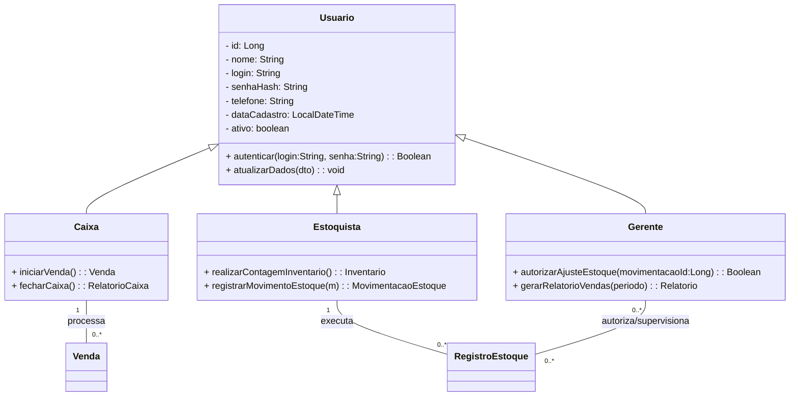

# Diagrama: Usuario (Mermaid)

Descrição: Representa um usuário do sistema com subclasses (Caixa, Estoquista, Gerente).

```mermaid
classDiagram
  class Usuario {
    - id: Long
    - nome: String
    - login: String
    - senhaHash: String
    - telefone: String
    - dataCadastro: LocalDateTime
    - ativo: boolean
    + autenticar(login:String, senha:String): Boolean
    + atualizarDados(dto): void
  }

  class Caixa {
    + iniciarVenda(): Venda
    + fecharCaixa(): RelatorioCaixa
  }
  class Estoquista {
    + realizarContagemInventario(): Inventario
    + registrarMovimentoEstoque(m): MovimentacaoEstoque
  }
  class Gerente {
    + autorizarAjusteEstoque(movimentacaoId:Long): Boolean
    + gerarRelatorioVendas(periodo): Relatorio
  }

  Usuario <|-- Caixa
  Usuario <|-- Estoquista
  Usuario <|-- Gerente

  %% Relações de contexto (stubs)
  class Venda
  class RegistroEstoque
  Caixa "1" -- "0..*" Venda : processa
  Estoquista "1" -- "0..*" RegistroEstoque : executa
  Gerente "0..*" -- "0..*" RegistroEstoque : autoriza/supervisiona
```
