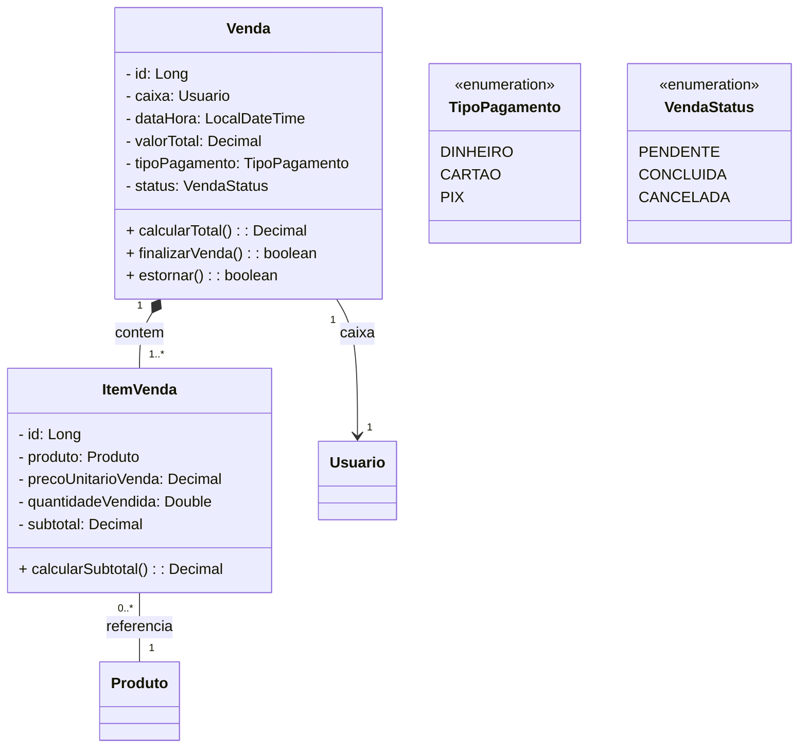

# Diagrama: Venda + ItemVenda (Mermaid)

Descrição: Representa a transação de venda e seus itens.

```mermaid
classDiagram
  class Venda {
    - id: Long
    - caixa: Usuario
    - dataHora: LocalDateTime
    - valorTotal: Decimal
    - tipoPagamento: TipoPagamento
    - status: VendaStatus
    + calcularTotal(): Decimal
    + finalizarVenda(): boolean
    + estornar(): boolean
  }

  class ItemVenda {
    - id: Long
    - produto: Produto
    - precoUnitarioVenda: Decimal
    - quantidadeVendida: Double
    - subtotal: Decimal
    + calcularSubtotal(): Decimal
  }

  %% Enums (representação)
  class TipoPagamento {
    <<enumeration>>
    DINHEIRO
    CARTAO
    PIX
  }
  class VendaStatus {
    <<enumeration>>
    PENDENTE
    CONCLUIDA
    CANCELADA
  }

  Venda "1" *-- "1..*" ItemVenda : contem
  ItemVenda "0..*" -- "1" Produto : referencia
  Venda "1" --> "1" Usuario : caixa
```
