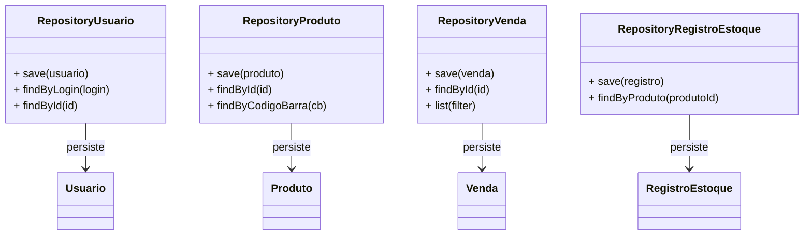

# Diagrama: Repositories (Mermaid)

Descrição: Interfaces de persistência (Repository/DAO).

```mermaid
classDiagram
  class RepositoryUsuario {
    + save(usuario)
    + findByLogin(login)
    + findById(id)
  }
  class RepositoryProduto {
    + save(produto)
    + findById(id)
    + findByCodigoBarra(cb)
  }
  class RepositoryVenda {
    + save(venda)
    + findById(id)
    + list(filter)
  }
  class RepositoryRegistroEstoque {
    + save(registro)
    + findByProduto(produtoId)
  }

  RepositoryUsuario --> Usuario : persiste
  RepositoryProduto --> Produto : persiste
  RepositoryVenda --> Venda : persiste
  RepositoryRegistroEstoque --> RegistroEstoque : persiste
```
